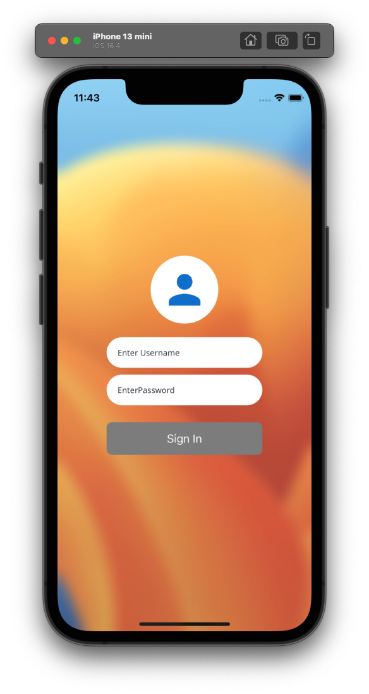
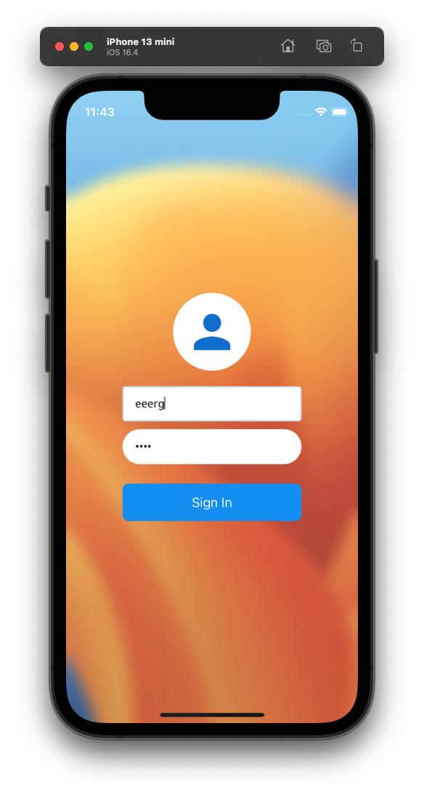
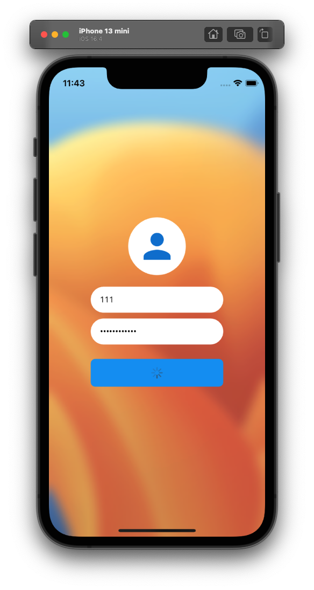
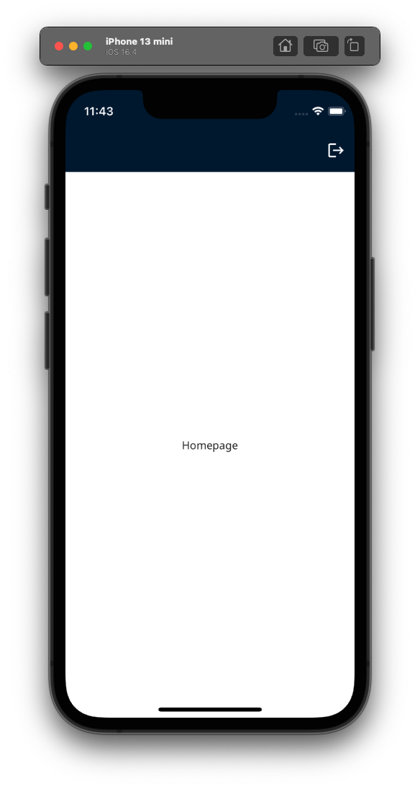

# Clean Architecture Flutter

This project is a demonstration of how Clean Architecture can be implemented in a Flutter application. It serves as a practical showcase to understand the different layers and components of Clean Architecture in a real-world scenario.

## Features

**Login**: A fully implemented login feature that interacts with a backend to authenticate users.
**Homepage**: An empty homepage that users are directed to after a successful login.

## Architecture Components

The project is structured based on the principles of Clean Architecture, and each features include:

- **Datasources**: Where the data for the application originates, be it local databases, network calls, or mock data.
- **Models**: Data models that define the shape and structure of the data.
- **Repositories**: Mediators between different data sources and the rest of the application.
- **Entities**: Business logic objects that represent the core of the application.
- **Use Cases**: Representing each use case of the application.
- **Logic**: Business logic of the application.
- **Widgets**: UI components of the Flutter application.

## Getting Started

### Prerequisites
1. Flutter SDK installed and set up on your local machine. You may use fvm to handle this. (Recommended Flutter version for this project is **3.13.1**)
2. A running backend, which this app communicates with for the authentication process. The backend can be found at this [GitHub Link](https://github.com/Blue-Cheesecake/REST-APIs-Express-Typescript-DI).
3. If you running on android simulator, don't forget to change base url api on .vscode/launch.json on 
```        
  // This api url work only local development on Android
  "--dart-define=apiURL=http://10.0.2.2:8080",
  // "--dart-define=apiURL=http://localhost:8080",
```

### Running the Project

1. Clone this repository
2. If you running on Android Studio of any IDE excep VSCode, don't forget to separate stage of running. You should config that in order to run application without any issues (Look at `.vscode/launch.json`).
3. Choose `dev` run stage and run it. You may try `stg`, or `prd` but don't fotget to put base url api variable.

### Screenshots

<div style="display: flex;">
  
  
</div>
<div style="display: flex;">
  
  
</div>

### Contribution

Feel free to fork the project, open issues, and submit PRs. This project is meant for educational purposes, and contributions are welcome to enhance the demonstration of Clean Architecture principles.